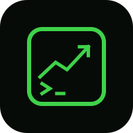

<p align="center">
  
</p>

<p align="center">
  <a href="https://github.com/noam-bash/claude-stock-ticker/actions/workflows/ci.yml"></a>
  <a href="LICENSE"></a>
  <a href="https://noam-bash.github.io/claude-stock-ticker/"></a>
</p>

# stock-ticker — a live stock ticker for the Claude Code status line

Replaces the bottom status bar with a rotating mini stock ticker — price, daily change, and an intraday sparkline — while keeping your model and context usage in view:

```
● NVDA $204.87 ▲2.22% ▂▃▃▅▄▆▇ 2/4  │  Fable 5 · 34% ctx
```

The leading dot shows market status for the displayed symbol's exchange: blinking green while the market is open for regular trading, steady red otherwise (pre/post-market, weekends, holidays). The blink is two layers: the ANSI blink attribute gives sub-second flashing in terminals that animate it (Windows Terminal does), and the dot also alternates bright/dim on every status line render as a fallback pulse — set `refreshInterval: 1` for the smoothest effect.

Symbols rotate automatically on a timer (`rotateSeconds`). You can nudge the rotation forward by asking Claude (`/ticker next`), which bumps the `offset` field in `claude-stock-ticker-state.json`.

Quotes come from Yahoo Finance's public chart endpoint (no API key). All symbols in your list refresh once a minute (stale quotes are fetched in parallel on each status line tick), and the 60-second cache keeps the frequent refreshes from hammering the API. Symbols rotate every 10 seconds. Works with stocks, indices (`^GSPC`), and crypto (`BTC-USD`).

> Claude Code's spinner only supports static text (`spinnerVerbs`), so the status line is the surface for live data — it refreshes on a timer via `refreshInterval`.

## Requirements

- Node.js 18+ on your `PATH` (uses the built-in `fetch`)
- Claude Code with status line support

## Install

As a plugin:

```
/plugin marketplace add noam-bash/claude-stock-ticker
/plugin install stock-ticker
/ticker install
```

Or manually — add to `~/.claude/settings.json` (forward slashes matter on Windows):

```json
{
  "statusLine": {
    "type": "command",
    "command": "node \"C:/path/to/stock-ticker/scripts/ticker.mjs\"",
    "refreshInterval": 5
  }
}
```

## Configure

`~/.claude/stock-ticker.json` (all keys optional):

```json
{
  "symbols": ["SPY", "NVDA", "AAPL", "TSLA"],
  "rotateSeconds": 10,
  "cacheTtlSeconds": 60,
  "sparkPoints": 8,
  "showSession": true,
  "hyperlink": true
}
```

The symbol name is an [OSC 8 hyperlink](https://code.claude.com/docs/en/statusline) to its Yahoo Finance quote page — Ctrl+click (Cmd+click on macOS) opens it in your browser. Requires a terminal with hyperlink support; if your terminal supports them but they aren't clickable, launch Claude Code with `FORCE_HYPERLINK=1`. Set `"hyperlink": false` if the link escapes garble your display.

With the plugin installed, `/ticker` manages all of this conversationally: `/ticker set NVDA, BTC-USD`, `/ticker speed 5`, `/ticker status`, `/ticker doctor`, `/ticker uninstall`.

## Layouts & extras

Set `"layout"` to choose how the segment renders (all keys optional, extras default off):

- `"rotate"` (default) — one symbol at a time: `● NVDA $204.87 ▲2.22% ▂▃▅▆▇`
- `"compact"` — the whole list at once: `● SPY ▲0.54%  NVDA ▲0.16%  AAPL ▼1.52%`
- `"portfolio"` — totals from `"holdings"`: `● Port $3,251 ▲$13.57 0.42%`

```json
{
  "layout": "portfolio",
  "holdings": { "AAPL": 10, "NVDA": { "qty": 5 } },
  "showVolume": true,
  "showDayRange": true,
  "show52w": true,
  "alertPercent": 5
}
```

- `holdings` — `{ "SYMBOL": qty }` (or `{ "qty": n }`); portfolio shows total value and day P/L.
- `showVolume` / `showDayRange` / `show52w` — opt-in fields appended in rotate mode (volume, day low–high, 52-week range).
- `alertPercent` — when a move's daily % meets this threshold, the change is bolded with a `!`.

It's display-only — there are no buttons or click actions on the status line.

## Data providers

Quotes resolve through a fallback chain so one source being down doesn't blank the ticker:

- Yahoo Finance (default, no key) — tried on two hosts (`query1`/`query2`).
- CoinGecko (no key) — automatic fallback for known crypto symbols (`BTC-USD`, `ETH-USD`, …).
- Finnhub (optional) — a general fallback when you set an API key via `FINNHUB_API_KEY` (env) or `"finnhubKey"` in the config.

Override the order per your taste with `"providers": ["yahoo", "finnhub", "coingecko"]`. Run `/ticker doctor` (or `node scripts/ticker.mjs --doctor`) to see your config, which providers respond and how fast, and a live sample quote.

## How it works

`scripts/ticker.mjs` runs on every status line refresh. It picks the current symbol from the wall clock (`(now / rotateSeconds + offset) mod symbols.length` — stateless rotation, no daemon), then resolves every symbol whose cached quote is older than `cacheTtlSeconds` in parallel through the provider chain (`scripts/providers.mjs`, 2-second timeout per request). Market open/closed for the dot comes from the exchange's regular-session window in the response, so it respects each exchange's hours, weekends, and holidays. Failures fall back to the cached quote (marked `(cached)` after 15 minutes), or a dimmed `SYM —` if there's nothing cached yet.

The `offset` (advanced by `/ticker next`) and the dot's pulse frame are the only things kept in `claude-stock-ticker-state.json`. There is no next-symbol button — rotation is purely timer-driven.

## Tests

```
node --test
```

Zero-dependency suite using Node's built-in `node:test` — unit tests for the sparkline, market dot, hyperlink, rotation index, and quote formatting, plus an end-to-end run of the script against a pre-warmed cache (no network) that also asserts no button is rendered. The `STOCK_TICKER_CONFIG` / `STOCK_TICKER_CACHE` / `STOCK_TICKER_STATE` env vars let tests point at temporary files instead of your real config.

## Branding

Logo and icon assets live in [`assets/`](assets/): `logo.svg` (master), `logo-lockup.svg` (icon + wordmark), `favicon.svg`, `favicon.ico`, `apple-touch-icon.png`, and `icon-{16,32,48,64,180,192,512}.png`. The mark is a terminal frame with an uptrend arrow and a `>_` prompt — green on near-black. The logo is for the repo and marketing only; it is not shown in the status line itself.

## Disclaimer

Quotes are delayed and unofficial — this is terminal candy, not trading infrastructure.
